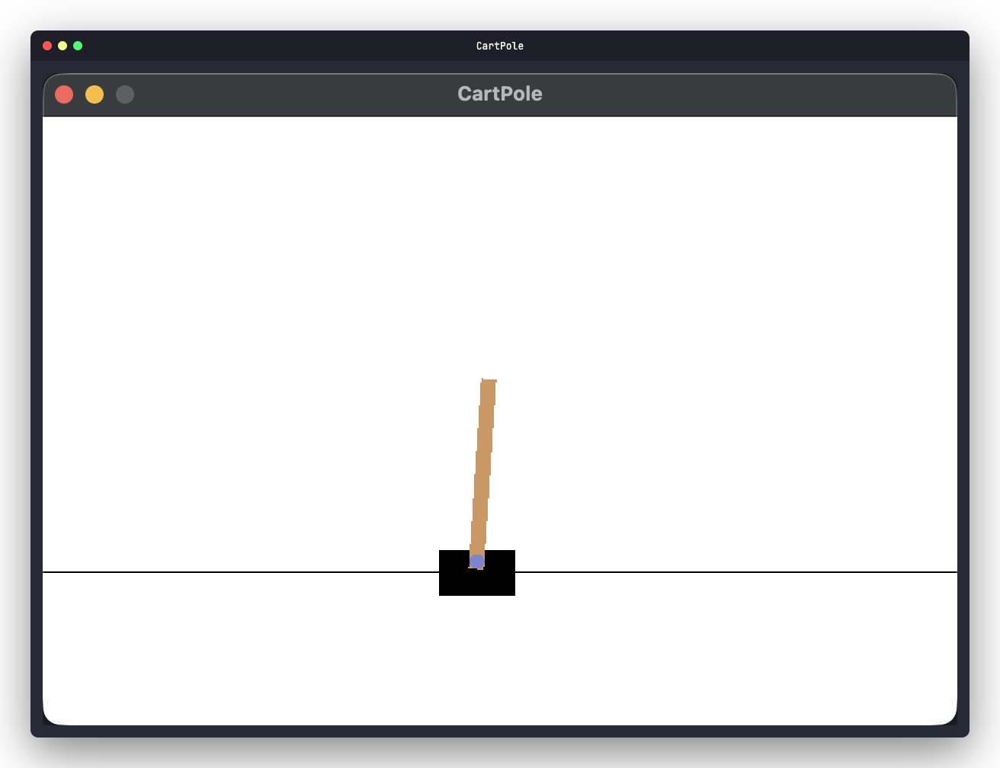
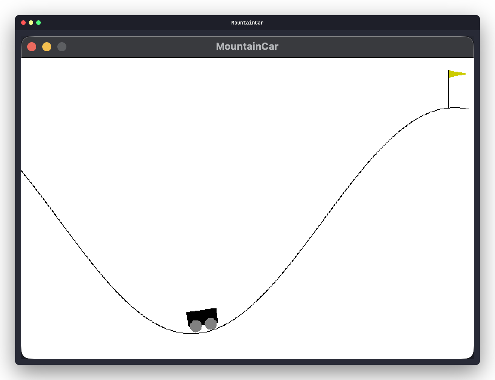

<p align="center">
  <h1 align="center">gymnasia</h1>
  <p align="center">
    OpenAI Gymnasium environments in pure Rust.
    <br /><br />
    <a href="https://github.com/urmzd/gymnasia/releases">Install</a>
    &middot;
    <a href="https://github.com/urmzd/gymnasia/issues">Report Bug</a>
    &middot;
    <a href="https://crates.io/crates/gymnasia">Crates.io</a>
  </p>
</p>

<p align="center">
  <a href="https://github.com/urmzd/gymnasia/actions/workflows/ci.yml"></a>
  <a href="https://crates.io/crates/gymnasia"></a>
  <a href="https://docs.rs/gymnasia"></a>
</p>

## Showcase

<table align="center">
  <tr>
    <td align="center">
      
      <br />
      <sub><b>CartPole</b></sub>
    </td>
    <td align="center">
      
      <br />
      <sub><b>MountainCar</b></sub>
    </td>
  </tr>
  <tr>
    <td align="center" colspan="2">
      
      <br />
      <sub><b>CartPole (headless)</b></sub>
    </td>
  </tr>
</table>

## Architecture

Unlike Python Gymnasium, gymnasia **separates simulation from rendering** and
uses **pure-Rust dependencies only** — no C bindings, no SDL2, no system library
installation.

| Layer | What it does | Feature gate |
|-------|-------------|--------------|
| `Env` trait | Pure physics — `step()`, `reset()` | Always compiled |
| `Renderable` trait | Produces a `DrawList` (backend-agnostic draw commands) | Always compiled |
| `Wrapper` trait | Composable behavior wrappers (`TimeLimit`, `NormalizeObservation`, etc.) | Always compiled |
| `Screen` | Translates `DrawList` into graphics calls (macroquad) | `render` feature |
| `RenderEnv<E>` | Wraps `Env + Renderable` with a `Screen` — implements `Env` | `render` feature |

### Design decisions

- **`Env` has zero supertraits** — no `Clone + Debug + Serialize`. Wrappers with closures work.
- **Wrappers own their data** — no info dict. `RecordEpisodeStatistics` exposes `episode_return()`, `TimeLimit` exposes `steps_remaining()`.
- **`BoxSpace<B: Bounded>`** — generic over the bounds representation. Implement `Bounded` on your own types.
- **`Flatten` is opt-in** — bidirectional `flatten()`/`unflatten()` for ML pipelines. Not required by `Env`.
- **`StepResult` uses `f64` reward** — `O64` stays internal.

## Quick Start

```bash
cargo add gymnasia
```

Headless by default — no graphics dependencies. To enable rendering:

```bash
cargo add gymnasia --features render
```

### Development

```bash
just fetch     # fetch dependencies
just build     # build the project
just fmt       # format code
just lint      # run clippy
just check     # run all CI checks (fmt + lint + test)
```

### Headless

```rust
use gymnasia::core::Env;
use gymnasia::envs::classical_control::cartpole::CartPoleEnv;

let mut env = CartPoleEnv::new();
env.reset(None, None);
let result = env.step(1); // 0 = left, 1 = right
println!("reward: {}, terminated: {}", result.reward, result.terminated);
```

```bash
cargo run --example=cartpole_headless --no-default-features
```

### With wrappers

```rust
use gymnasia::core::Env;
use gymnasia::envs::classical_control::cartpole::CartPoleEnv;
use gymnasia::wrappers::{TimeLimit, RecordEpisodeStatistics};

let env = CartPoleEnv::new();
let env = TimeLimit::new(env, 500);
let mut env = RecordEpisodeStatistics::new(env);
// Type: RecordEpisodeStatistics<TimeLimit<CartPoleEnv>>

let obs = env.reset(None, None);
let result = env.step(1);

// Typed access to wrapper data:
println!("return: {}", env.episode_return());
println!("steps left: {}", env.inner().steps_remaining());
```

### Flatten for ML

```rust
use gymnasia::core::{Env, Flatten};
use gymnasia::envs::classical_control::cartpole::CartPoleEnv;

let mut env = CartPoleEnv::new();
let obs = env.reset(None, None);
let flat: Vec<f64> = obs.flatten();   // [x, x_dot, theta, theta_dot]
assert_eq!(flat.len(), 4);
```

### With rendering

```rust
use gymnasia::core::Env;
use gymnasia::render::{RenderEnv, renderer::RenderMode};
use gymnasia::envs::classical_control::cartpole::CartPoleEnv;

#[macroquad::main("CartPole")]
async fn main() {
    let env = CartPoleEnv::new();
    let mut renv = RenderEnv::new(env, RenderMode::Human);
    renv.reset(None, None);
    loop {
        let result = renv.step(1);
        renv.next_frame().await;
        if result.terminated { break; }
    }
}
```

```bash
cargo run --example=cartpole --features render
cargo run --example=mountain_car --features render
```

### Custom environment

```rust
use gymnasia::core::{Env, StepResult};
use gymnasia::spaces::{Bounded, BoxSpace, Discrete};

// 1. Define your observation type
#[derive(Clone, Debug)]
struct MyObs { x: f64, y: f64 }

// 2. Implement Bounded so it works with BoxSpace
impl Bounded for MyObs {
    fn in_bounds(v: &Self, lo: &Self, hi: &Self) -> bool {
        v.x >= lo.x && v.x <= hi.x && v.y >= lo.y && v.y <= hi.y
    }
    fn sample_uniform<R: rand::Rng>(rng: &mut R, lo: &Self, hi: &Self) -> Self {
        MyObs { x: rng.gen_range(lo.x..=hi.x), y: rng.gen_range(lo.y..=hi.y) }
    }
}

// 3. Implement Env
struct MyEnv { /* ... */ }
impl Env for MyEnv {
    type Action = usize;
    type Observation = MyObs;
    type ActionSpace = Discrete;
    type ObservationSpace = BoxSpace<MyObs>;
    type ResetOptions = ();
    // ...
#   fn step(&mut self, _: usize) -> StepResult<MyObs> { todo!() }
#   fn reset(&mut self, _: Option<u64>, _: ()) -> MyObs { todo!() }
#   fn action_space(&self) -> &Discrete { todo!() }
#   fn observation_space(&self) -> &BoxSpace<MyObs> { todo!() }
}
```

Full API documentation is available on [docs.rs](https://docs.rs/gymnasia).

## Wrappers

Wrappers are generic structs that implement `Env` by delegating to an inner environment. Stack them to compose behaviors:

| Wrapper | Category | What it does |
|---------|----------|-------------|
| `TimeLimit` | Common | Truncates after N steps |
| `OrderEnforcing` | Common | Panics if `step()` before `reset()` |
| `Autoreset` | Common | Auto-resets on termination |
| `RecordEpisodeStatistics` | Common | Tracks cumulative reward and episode length |
| `ClipReward` | Reward | Clamps reward to `[min, max]` |
| `NormalizeReward` | Reward | Running mean/variance normalization |
| `TransformReward` | Reward | Apply custom `Fn(f64) -> f64` |
| `ClipAction` | Action | Clamps to action space bounds |
| `RescaleAction` | Action | Affine rescaling of `f64` actions |
| `TransformAction` | Action | Apply custom function, may change type |
| `FlattenObservation` | Observation | Flattens via `Flatten` trait to `Vec<f64>` |
| `NormalizeObservation` | Observation | Running mean/variance normalization |
| `TransformObservation` | Observation | Apply custom function, may change type |

Wrappers that track metadata expose it via typed methods on the wrapper itself — there is no dynamic info dict.

## Spaces

| Space | Element | Description |
|-------|---------|-------------|
| `BoxSpace<B: Bounded>` | `B` | Continuous bounded space. Generic over bounds type. |
| `Discrete` | `i64` | `{start, ..., start+n-1}`. Supports action masking. |
| `MultiDiscrete` | `Vec<i64>` | Cartesian product of discrete spaces. |
| `MultiBinary` | `Vec<u8>` | `{0, 1}^n`. |

Implement `Bounded` on any type to use it with `BoxSpace`. We ship implementations for `f64`, `f32`, and `Tensor` (flat `Vec<f64>` with shape metadata for high-dimensional spaces like images).

## Feature Flags

| Feature | Default | Description |
|---------|---------|-------------|
| `render` | No | macroquad-based window rendering and pixel capture |

## Benchmarks

<!-- embed-src src="benches/RESULTS.md" -->
| Benchmark | Time (median) |
|-----------|---------------|
| `cartpole/step` | ~26 ns |
| `cartpole/reset` | ~21 ns |
| `cartpole/episode` | ~248 ns |
| `mountain_car/step` | ~25 ns |
| `mountain_car/reset` | ~15 ns |
| `mountain_car/episode` | ~4.6 us |

> Apple M3 Pro — `cargo bench` via [Criterion](https://github.com/bheisler/criterion.rs). Run `cargo bench` to reproduce.
<!-- /embed-src -->

## Migrating from v2

See [CHANGELOG.md](./CHANGELOG.md) for the full list. Key changes:

| v2 | v3 |
|----|-----|
| `ActionReward<T, E>` | `StepResult<O>` |
| `reward: O64` | `reward: f64` |
| `info: Option<E>` | removed — wrappers own their data |
| `reset(seed, return_info, options)` | `reset(seed, options)` returns `Observation` |
| `BoxR<T>` | `BoxSpace<B: Bounded>` |
| `Observation: Into<Vec<f64>>` required | `Flatten` trait (opt-in) |
| `Clone + Debug + Serialize` on `Env` | no supertraits |
| `Discrete(usize)` | `Discrete { n, start }` with `i64` element |
| `DiscreteRange` | merged into `Discrete::with_start()` |
| `RenderEnv` doesn't impl `Env` | `RenderEnv` implements `Env` |
| No wrappers | 13 composable wrappers |
| `use gymnasia::render::RenderEnv` | `use gymnasia::render::RenderEnv` |
| `use gymnasia::utils::renderer::RenderMode` | `use gymnasia::render::renderer::RenderMode` |

## History

Gymnasia is a fork of
[MathisWellmann/gym-rs](https://github.com/MathisWellmann/gym-rs), which is no
longer actively maintained. OpenAI Gym itself has since evolved into
[Gymnasium](https://github.com/Farama-Foundation/Gymnasium) — gymnasia tracks
that direction for Rust. See [ROADMAP.md](./ROADMAP.md) for feature parity status.

## Contributing

Contributions are welcome. See [CONTRIBUTING.md](./CONTRIBUTING.md) for guidelines.

## Agent Skill

This repo's conventions are available as portable agent skills in [`skills/`](skills/).

## License

Licensed under [Apache 2.0](./LICENSE).
