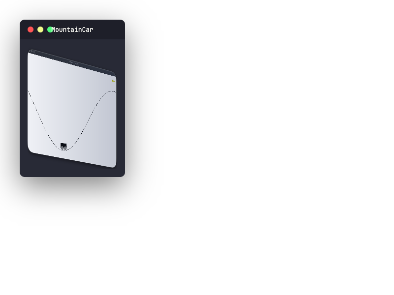

<p align="center">
  <h1 align="center">gymnasia</h1>
  <p align="center">
    OpenAI Gymnasium environments in pure Rust.
    <br /><br />
    <a href="https://github.com/urmzd/gymnasia/releases">Install</a>
    &middot;
    <a href="https://github.com/urmzd/gymnasia/issues">Report Bug</a>
    &middot;
    <a href="https://crates.io/crates/gymnasia">Crates.io</a>
  </p>
</p>

<p align="center">
  <a href="https://github.com/urmzd/gymnasia/actions/workflows/ci.yml"></a>
  <a href="https://crates.io/crates/gymnasia"></a>
</p>

## Showcase

<p align="center">
  
</p>

## Architecture

Unlike Python Gymnasium, gymnasia **separates simulation from rendering**:

| Layer | What it does | Feature gate |
|-------|-------------|--------------|
| `Env` trait | Pure physics — `step()`, `reset()` | Always compiled |
| `Renderable` trait | Produces a `DrawList` (backend-agnostic draw commands) | Always compiled |
| `RenderEnv<E>` wrapper | Composes `Env + Renderable` with a macroquad window | `render` feature |

Gymnasium mixes rendering into every `step()` / `reset()` call and requires
`render_mode` at construction. This couples every environment to a graphics
backend and complicates headless usage. Gymnasia keeps the simulation pure and
makes rendering an opt-in wrapper with zero impact on the core library.

## Quick Start

```toml
[dependencies]
gymnasia = "2"
```

Headless by default — no graphics dependencies. To enable rendering:

```toml
[dependencies]
gymnasia = { version = "2", features = ["render"] }
```

### Headless

```rust
use gymnasia::{core::Env, envs::classical_control::cartpole::CartPoleEnv};

let mut env = CartPoleEnv::new();
env.reset(None, false, None);
let result = env.step(1);
```

```bash
cargo run --example=cartpole_headless
```

### With rendering

```rust
use gymnasia::{core::Env, render::RenderEnv, utils::renderer::RenderMode};
use gymnasia::envs::classical_control::cartpole::CartPoleEnv;

#[macroquad::main("CartPole")]
async fn main() {
    let env = CartPoleEnv::new();
    let mut renv = RenderEnv::new(env, RenderMode::Human);
    renv.reset(None, false, None);
    loop {
        let result = renv.step(1);
        macroquad::prelude::next_frame().await;
        if result.terminated { break; }
    }
}
```

```bash
cargo run --example=cartpole --features render
```

## Examples

<table align="center">
  <tr>
    <td align="center">
      
      <br />
      <sub><b>CartPole</b></sub>
      <br />
      <code>cargo run --example=cartpole --features render</code>
    </td>
    <td align="center">
      
      <br />
      <sub><b>MountainCar</b></sub>
      <br />
      <code>cargo run --example=mountain_car --features render</code>
    </td>
  </tr>
</table>

## Feature Flags

| Feature | Default | Description |
|---------|---------|-------------|
| `render` | No | macroquad-based window rendering and pixel capture |

## Contributing

Contributions are welcome. See [CONTRIBUTING.md](./CONTRIBUTING.md) for guidelines.

## Agent Skill

This repo's conventions are available as portable agent skills in [`skills/`](skills/).

## License

Licensed under [Apache 2.0](./LICENSE).
