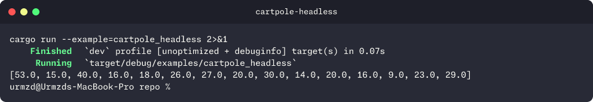
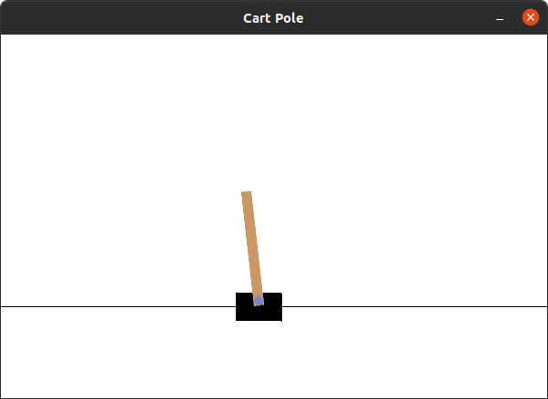
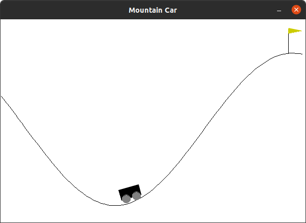

<p align="center">
  <h1 align="center">gymnasia</h1>
  <p align="center">
    OpenAI Gymnasium environments in pure Rust.
    <br /><br />
    <a href="https://github.com/urmzd/gymnasia/releases">Install</a>
    &middot;
    <a href="https://github.com/urmzd/gymnasia/issues">Report Bug</a>
    &middot;
    <a href="https://crates.io/crates/gymnasia">Crates.io</a>
  </p>
</p>

<p align="center">
  <a href="https://github.com/urmzd/gymnasia/actions/workflows/ci.yml"></a>
</p>

## Showcase

<p align="center">
  
</p>

## Quick Start

```toml
[dependencies]
gymnasia = "1.0.0"
```

For headless usage (no SDL2 required):

```toml
[dependencies]
gymnasia = { version = "1.0.0", default-features = false }
```

See [USAGE.md](./USAGE.md) for detailed setup instructions across different operating systems.

## Examples

<table align="center">
  <tr>
    <td align="center">
      
      <br />
      <sub><b>CartPole</b></sub>
      <br />
      <code>cargo run --example=cartpole</code>
    </td>
    <td align="center">
      
      <br />
      <sub><b>MountainCar</b></sub>
      <br />
      <code>cargo run --example=mountain_car</code>
    </td>
  </tr>
</table>

### Headless

```bash
cargo run --example=cartpole_headless --no-default-features
```

## Feature Flags

| Feature | Default | Description |
|---------|---------|-------------|
| `sdl2` | Yes | SDL2 rendering and nalgebra support |
| `bundled` | Yes | Compiles SDL2 from source (no system install needed) |

## Contributing

Contributions are welcome. See [CONTRIBUTING.md](./CONTRIBUTING.md) for guidelines.

## Agent Skill

This repo's conventions are available as portable agent skills in [`skills/`](skills/).

## License

Licensed under [Apache 2.0](./LICENSE).
